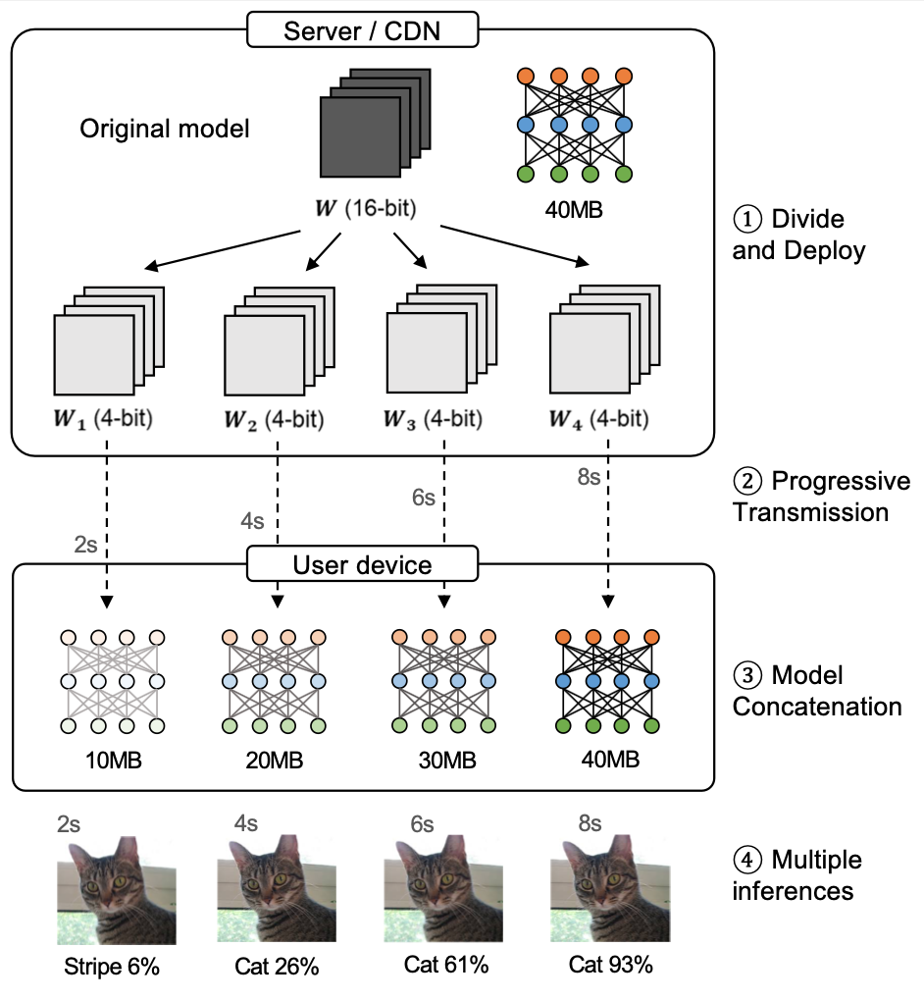
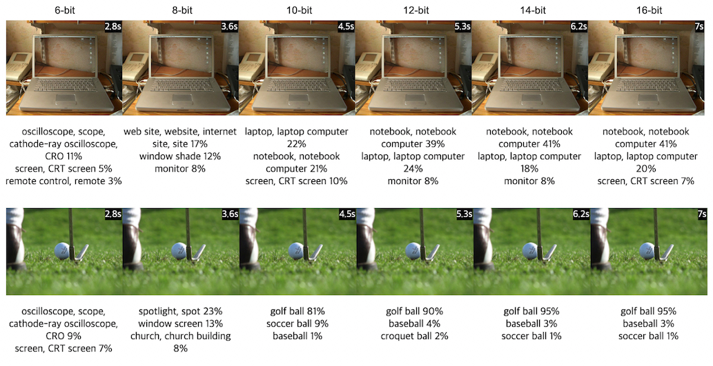
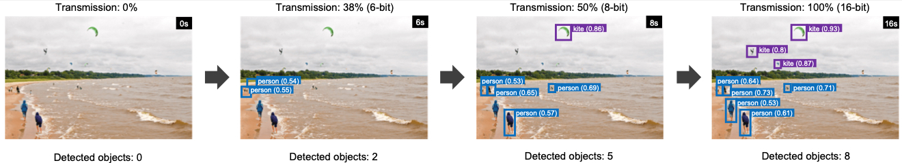

# ProgressiveNet

[](https://www.npmjs.com/package/progressivenet)

Official implementation of the paper "Progressive Transmission and Inference of Deep Learning Models", a working paper.

Youngsoo Lee<sup>1</sup>, Sangdoo Yun<sup>2</sup>, Sunghee Choi<sup>1</sup>

<sup>1</sup> School of Computing, Korea Advanced Institute of Science and Technology(KAIST)  
<sup>2</sup> AI LAB, NAVER Corp.

<p align="center">
    
</p>

### Abstract

Modern image files are usually progressively transmitted and provide a preview before downloading the entire image for improved user experience to cope with a slow network connection. In this paper, with a similar goal, we propose a progressive transmission framework for deep learning models, especially to deal with the scenario where pre-trained deep learning models are transmitted from servers and executed at user devices (e.g., web browser or mobile). Our progressive transmission allows inferring approximate models in the middle of file delivery, and quickly provide an acceptable intermediate outputs. On the server-side, a deep learning model is divided and progressively transmitted to the user devices. Then, the divided pieces are progressively concatenated to construct approximate models on user devices. Experiments show that our method is computationally efficient without increasing the model size and total transmission time while preserving the model accuracy. We further demonstrate that our method can improve the user experience by providing the approximate models in a slow connection.


## Examples and Demo

**Image classification Model (MobileNetV2):**

<p align="center">
    
</p>

**Object Detection Model (SSD-MobileNetV2):**

<p align="center">
    
</p>

**Demo:**  
You can try using our pre-built models in [https://prev.github.io/progressivenet](https://prev.github.io/progressivenet)


## Getting Started

ProgressiveNet is implemented based on [TensorFlowJS](https://github.com/tensorflow/tfjs), which is an open-source hardware-accelerated JavaScript library for training and deploying machine learning models.
Our implementation interacts with the TFJS core engine, by passing the intermediate weight matrices to the TFJS and receives the approximiate results in the middle of the transmission.

### How to install

```
$ npm install progressivenet
```

### How to use (Classification Model)

```js
import { ProgressiveNet, Classifier } from 'progressivenet';

const pgNet = new ProgressiveNet({
    modelUrl: '<model_url>',
    numProgressSteps: 8,
});
const img = document.getElementById('my-img');

pgNet.loadSequentially((model, isLast, progressStep) => {
    const classifier = new Classifier(model);
    const predictions = await classifier.classify(img);
    console.log('Result from step #' + progressStep + ':', predictions);

}).then() => {
    console.log('All models are transmitted and inferenced');
}
```

### How to use (Detection Model)

```js
import { ProgressiveNet, ObjectDetector } from 'progressivenet';

const pgNet = new ProgressiveNet({ modelUrl: '<model_url>' });
const img = document.getElementById('my-img');

pgNet.loadSequentially((model, isLast, progressStep) => {
    const detector = new ObjectDetector(model);
    const predictions = await detector.detect(img);
    console.log('Result from step #' + progressStep + ':', predictions);

}).then() => {
    console.log('All models are transmitted and inferenced');
}
```

You can see the detailed code in [demo](./demo). It is written in TypeScript and implemented with jQuery.

## Advanced Usage

Rather than implementing a training code for ProgressiveNet, we provide a **converter** for generating progressive model from static TensorFlowJS model.

Towards making your own model beyond our pre-converted models, try visiting [converter](./converter) directory for advanced usage.
Converter is implemented with TypeScript and and we provide command line interface(CLI) for converting TFJS models to progressive models.

## License

CC 4.0 Attribution-NonCommercial International.  
The software is for educaitonal and academic research purpose only.
